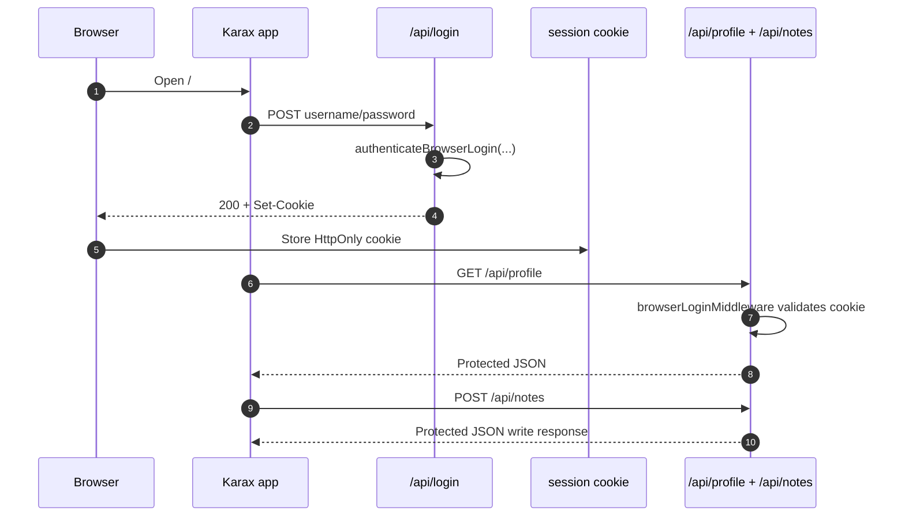

# Karax Browser Login Example

This example demonstrates Sarcophagus browser-session login without OAuth2:

- The Karax app posts username/password to `POST /api/login`.
- The server verifies credentials with `authenticateBrowserLogin`.
- Sarcophagus sets an `HttpOnly` session cookie.
- Same-origin `XMLHttpRequest` calls from Karax automatically send that cookie.
- Protected JSON endpoints use `browserLoginMiddleware`, not bearer tokens.

## Run

From the repository root:

```sh
nim js -o:examples/karax_browser_login/public/app.js examples/karax_browser_login/client.nim
nim c -r examples/karax_browser_login/server.nim
```

Open:

```text
http://127.0.0.1:9085
```

Demo accounts:

- `alice` / `correct horse battery staple`
- `bob` / `hunter2 hunter2`

## Flow



## Notes

This is intentionally a browser-cookie example, not an SPA bearer-token example.
Because the API accepts browser cookies, CSRF matters in real deployments. Use
HTTPS, `Secure` cookies, CSRF protection for state-changing routes, and durable
user/session storage outside this demo.
