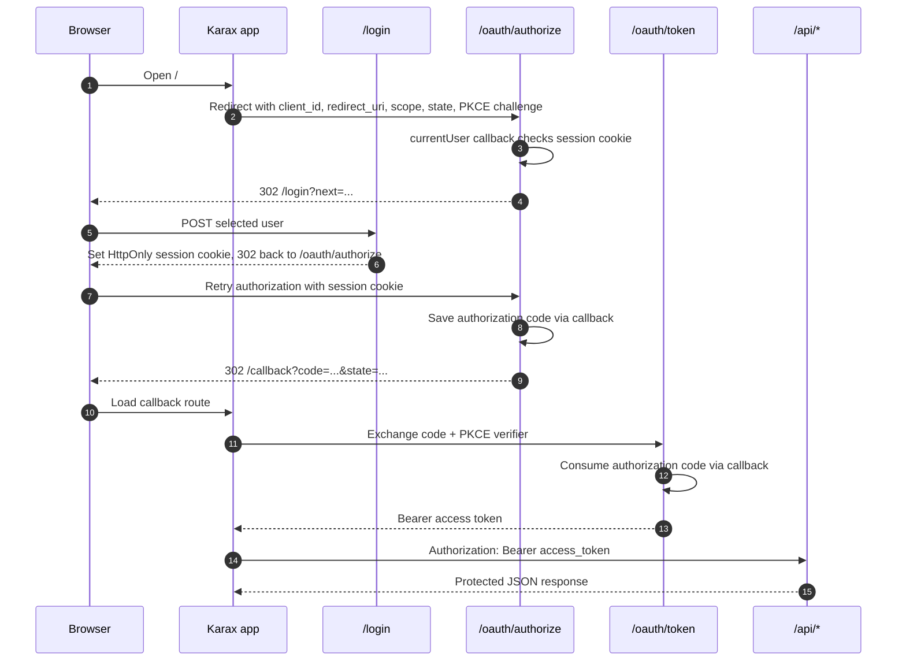

# Karax OAuth2 User Login Example

This example demonstrates the browser/user-login OAuth2 flow:

- The Mummy server owns the `/login` page and sets an `HttpOnly` session cookie.
- `/oauth/authorize` reads that session through a callback and issues an
  authorization code.
- The Karax app exchanges the code at `/oauth/token`.
- JSON endpoints under `/api` require `Authorization: Bearer ...`.

The browser session cookie is not accepted by the JSON endpoints.

## Run

From the repository root:

```sh
nim js -o:examples/oauth2_karax_login/public/app.js examples/oauth2_karax_login/client.nim
nim c -r examples/oauth2_karax_login/server.nim
```

Open:

```text
http://127.0.0.1:9084
```

Click **Sign in as Alice**. The browser will move through:

```text
/oauth/authorize -> /login -> /oauth/authorize -> /callback -> /oauth/token
```

## Flow



After the token exchange, the app calls:

- `GET /api/profile` with `profile:read`
- `POST /api/notes` with `notes:write`
- `GET /api/admin`, which intentionally fails with `insufficient_scope`

## Manual Curl Flow

With the server running on `127.0.0.1:9084`, this performs the same flow without
the Karax UI:

```sh
BASE=http://127.0.0.1:9084
COOKIE_JAR=/tmp/sarcophagus-karax-cookies.txt
VERIFIER=abcdefghijklmnopqrstuvwxyzABCDEFGHIJKLMNOPQRSTUVWXYZ0123456789-._~
STATE=manual-state
AUTH_PATH="/oauth/authorize?response_type=code&client_id=karax-browser&redirect_uri=http%3A%2F%2F127.0.0.1%3A9084%2Fcallback&scope=profile%3Aread+notes%3Awrite&state=$STATE&code_challenge=$VERIFIER&code_challenge_method=plain"
```

Start authorization. This should redirect to `/login?next=...` because there is
no session cookie yet:

```sh
curl -i "$BASE$AUTH_PATH"
```

Post the login form and store the session cookie:

```sh
LOGIN_REDIRECT=$(
  curl -sS -i -c "$COOKIE_JAR" -b "$COOKIE_JAR" \
    -X POST "$BASE/login" \
    -H 'Content-Type: application/x-www-form-urlencoded' \
    --data-urlencode "user=alice" \
    --data-urlencode "next=$AUTH_PATH" |
    awk 'tolower($1)=="location:" {print $2}' | tr -d '\r'
)
```

Retry authorization with the session cookie and capture the authorization code:

```sh
CALLBACK_REDIRECT=$(
  curl -sS -i -b "$COOKIE_JAR" "$BASE$LOGIN_REDIRECT" |
    awk 'tolower($1)=="location:" {print $2}' | tr -d '\r'
)

CODE=$(printf '%s' "$CALLBACK_REDIRECT" | sed -n 's/.*[?&]code=\([^&]*\).*/\1/p')
echo "$CALLBACK_REDIRECT"
```

Exchange the code for an access token:

```sh
TOKEN_JSON=$(
  curl -sS -X POST "$BASE/oauth/token" \
    -H 'Content-Type: application/x-www-form-urlencoded' \
    --data-urlencode 'grant_type=authorization_code' \
    --data-urlencode 'client_id=karax-browser' \
    --data-urlencode "code=$CODE" \
    --data-urlencode 'redirect_uri=http://127.0.0.1:9084/callback' \
    --data-urlencode "code_verifier=$VERIFIER"
)

ACCESS_TOKEN=$(printf '%s' "$TOKEN_JSON" | sed -n 's/.*"access_token":"\([^"]*\)".*/\1/p')
echo "$TOKEN_JSON"
```

Call protected APIs with the bearer token:

```sh
curl -sS "$BASE/api/profile" \
  -H "Authorization: Bearer $ACCESS_TOKEN"

curl -sS -X POST "$BASE/api/notes" \
  -H "Authorization: Bearer $ACCESS_TOKEN" \
  -H 'Content-Type: application/json' \
  -d '{"message":"Created from curl with an OAuth2 bearer token"}'
```

The admin endpoint is intentionally out of scope for Alice's token:

```sh
curl -i "$BASE/api/admin" \
  -H "Authorization: Bearer $ACCESS_TOKEN"
```

## Notes

This is a local development example. It uses `code_challenge_method=plain` so
the PKCE verifier is easy to inspect in the browser. Production browser clients
should use `S256`, strict HTTPS redirect URIs, CSRF protection on login forms,
and durable authorization-code storage.
