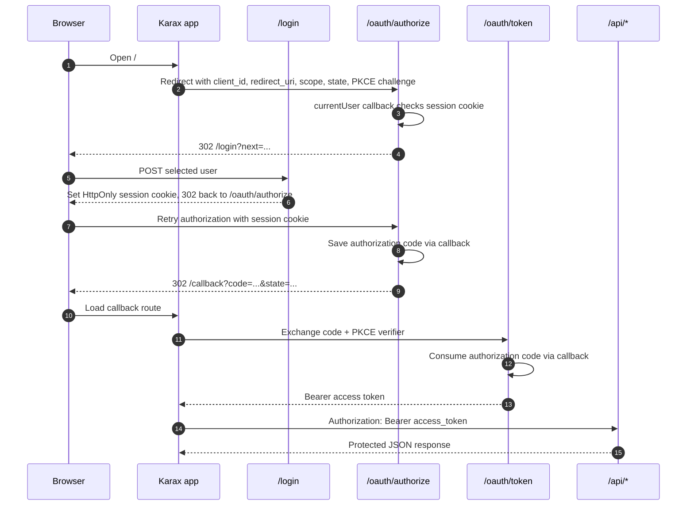

# Karax OAuth2 User Login Example

This example demonstrates the browser/user-login OAuth2 flow:

- The Mummy server owns the `/login` page and sets an `HttpOnly` session cookie.
- `/oauth/authorize` reads that session through a callback and issues an
  authorization code.
- The Karax app exchanges the code at `/oauth/token`.
- JSON endpoints under `/api` require `Authorization: Bearer ...`.

The browser session cookie is not accepted by the JSON endpoints.

## Run

From the repository root:

```sh
nim js -o:examples/oauth2_karax_login/public/app.js examples/oauth2_karax_login/client.nim
nim c -r examples/oauth2_karax_login/server.nim
```

Open:

```text
http://127.0.0.1:9084
```

Click **Sign in as Alice**. The browser will move through:

```text
/oauth/authorize -> /login -> /oauth/authorize -> /callback -> /oauth/token
```

## Flow



After the token exchange, the app calls:

- `GET /api/profile` with `profile:read`
- `POST /api/notes` with `notes:write`
- `GET /api/admin`, which intentionally fails with `insufficient_scope`

## Notes

This is a local development example. It uses `code_challenge_method=plain` so
the PKCE verifier is easy to inspect in the browser. Production browser clients
should use `S256`, strict HTTPS redirect URIs, CSRF protection on login forms,
and durable authorization-code storage.
